# Japan Tech Analyst

[](https://github.com/Bogdan0708/Japan_Agent/actions/workflows/ci.yml)

Paper-first, human-approved research and execution infrastructure for a £100 Japan new-technology
learning portfolio.

> **Safety state:** demo only by default. The repository does not contain a verified instrument
> whitelist, broker credentials, an agent identity, or permission to trade live. `doctor` treats all
> four as blockers. This is experimental software and not investment advice.

The language model can only return structured research. It cannot import the broker adapter or call a
money-moving tool. Pure Python turns an untrusted decision into an immutable ticket, applies the risk
policy, and records the ticket hash. A named human approves that exact hash. Immediately before a
broker POST, the code checks a fresh quote and a fresh Trading 212 portfolio snapshot again.

## What is implemented

- SQLite snapshot store, successful-ingest heartbeats, immutable proposals, execution claims, and a
  hash-chained event ledger with a JSONL mirror.
- GBP-normalized prices, including explicit handling of LSE pence (`GBX`) and mandatory FX conversion
  for USD/JPY instruments.
- J-Quants v2 and EDINET v2 clients; timestamped import boundaries for TDnet and cited news digests.
- Claude Agent SDK structured research with no broker or shell tools and a fail-closed snapshot gate.
- Deterministic 40% NAV cap, £15 satellite cap, three-trades-per-week limit, £5 cash floor, cash-only
  whitelist, stale-data checks, duplicate guard, and four-decimal share sizing.
- Telegram tickets whose buttons bind to the proposal UUID and ticket-hash prefix; callbacks are
  restricted to one configured user/chat and authenticated with Telegram's webhook secret header.
- Trading 212 v0 demo/live adapter. Non-idempotent order POSTs are never automatically retried. An
  uncertain response enters `RECONCILIATION_REQUIRED` and blocks resubmission.
- Local kill switch, broker reconciliation, weekly Markdown post generator, and independent live gates.
- A standard-library test suite (run `python3 -W error::ResourceWarning -m unittest discover`) covering limit violations, stale data, approval integrity, fresh-portfolio
  preflight, duplicate POST prevention, uncertain outcomes, kill switch, live refusal, pence/FX
  normalization, snapshot-manifest citation binding, future-coverage rejection, EDINET coverage
  honesty, ledger trigger/tamper detection, Modified Dietz math, and approval polling.

Also implemented since the first audit: automatic whitelist price collection with matched FX and
Yahoo "GBp" pence normalization (`collect-prices` + `config/data-symbols.json`), a Telegram
long-polling approval transport (`telegram-poll`, no inbound port; deletes any webhook and outlives
the server-side wait), locked/atomic cron wrapper scripts (`scripts/daily.sh`, `scripts/weekly.sh`
with Tokyo-calendar EDINET dates and a weekly J-Quants refresh), deterministic evidence-citation
validation (every research claim must cite an ingested item), per-source research quotas, an
observed-through freshness gate, append-only ledger triggers plus `verify-chain`, Modified Dietz
weekly returns, an expanded `doctor`, a `FRONTIER` sleeve capped like satellites
([docs/MANDATE-GUIDANCE.md](docs/MANDATE-GUIDANCE.md)), the Trading 212 written-consent request
draft ([docs/T212-CONSENT-REQUEST.md](docs/T212-CONSENT-REQUEST.md)), and the human account
checklist ([docs/ACCOUNT-SETUP.md](docs/ACCOUNT-SETUP.md)).

Not yet complete: account creation (see the checklist), T212 instrument verification, live API
response mapping to the fresh portfolio schema, the assistant-produced TDnet/news digests as a
recurring feed, local-LLM prose drafting, GitHub identity/Pages deployment, and the required 2–4 week
paper track record. Those need real accounts, credentials, and observed demo payloads.

## Setup

Python 3.11 or later is required.

```bash
cd japan-agent
python3 -m venv .venv
. .venv/bin/activate
python3 -m pip install -e '.[research,data,dev]'
cp .env.example .env
japan-agent init
japan-agent identity
```

The identity command is the one-time first-boot ritual: Claude chooses a professional name and the
deterministic validator writes `PERSONA.md` and `MANDATE.md`. It refuses to overwrite an existing
identity.

Run the zero-dependency verification suite before installing optional dependencies:

```bash
PYTHONPATH=src python3 -W error::ResourceWarning -m unittest discover -v
```

## Safe bring-up order

1. Create demo credentials with metadata, account, portfolio, history, and order permissions. Use an IP
   allowlist where practical.
2. Discover account-specific candidates. This command only prints results; it never edits the whitelist.

   ```bash
   japan-agent discover-instruments --term japan --term robotics --term sony
   ```

3. Verify every exact T212 ticker, currency, type, fractional availability, and account environment,
   then populate `config/whitelist.json` and set `verified_at`. An empty or unverified file blocks all
   proposals.
4. Import timestamped, normalized prices using `config/prices.example.json`. Foreign prices require an
   explicit `gbp_per_native_unit`; fetching time must not masquerade as market observation time.
5. Ingest J-Quants historical context, EDINET filings, TDnet headlines, and cited news. The research
   command refuses to run if any required source heartbeat is missing or stale.
6. Run research, review the JSON, construct a ticket against a reconciled portfolio, then send it.

   ```bash
   japan-agent research > data/latest-decision.json
   japan-agent propose --decision data/latest-decision.json --portfolio config/portfolio.example.json
   japan-agent send-ticket PROPOSAL_UUID
   ```

7. Serve the authenticated Telegram callback behind a TLS reverse proxy. Binding to localhost is the
   default.

   ```bash
   japan-agent telegram-serve --host 127.0.0.1 --port 8080
   ```

8. Demo execution requires an approved ticket, a quote observed within 20 minutes, and a Trading 212
   portfolio snapshot observed within two minutes. Until the response mapper is verified against the
   real demo account, produce that JSON through an inspected reconciliation step.

   ```bash
   japan-agent execute PROPOSAL_UUID --portfolio data/t212-portfolio-now.json
   japan-agent reconcile PROPOSAL_UUID
   japan-agent journal-sync
   ```

Use `japan-agent killswitch engage` at any time. It blocks local submissions. If credentials may be
compromised, also revoke them in Trading 212; deleting a local file does not revoke a server-side key.

## Corrections to the original brief

- A £50 single core holding conflicts with the 40% per-instrument cap, and £50 + £30 + £20 conflicts
  with the £5 cash floor. The first allocation must split the core or reduce invested amounts.
- The current Trading 212 docs describe API access for both Invest and Stocks ISA accounts; the older
  blanket statement that ISA API access is read-only should not be used as a current design premise.
- Human approval is sensible control, but it does not by itself prove compliance. Current API terms
  prohibit algorithmic trading, define it by algorithmic order-parameter determination with limited
  human intervention, and require prior written consent for a customised interface in live deployment.
  Live remains blocked pending written confirmation. See [COMPLIANCE.md](docs/COMPLIANCE.md).
- J-Quants Free is 12 weeks delayed. It is historical context, not same-day catalyst data. Its data
  must not be copied into the public journal, and recurring public analysis needs a licence review.
- The official TDnet API is paid. This project accepts timestamped output derived from the public
  disclosure pages; it does not pretend a free official API exists.

## Architecture

```mermaid
flowchart LR
    Sources[Timestamped local sources] --> Snapshots[SQLite snapshots + heartbeats]
    Snapshots --> Research[Paper-first Claude research]
    Research --> Risk[Deterministic risk engine]
    Risk --> Proposal[Immutable ticket + SHA-256 hash]
    Proposal --> Telegram[Telegram human approval]
    Telegram --> Preflight[Fresh quote + T212 portfolio preflight]
    Preflight --> Broker[Broker adapter: one non-idempotent POST]
    Broker --> Reconcile[Reconciliation state]
    Reconcile --> Ledger[Hash-chained event ledger]
    Ledger --> Journal[Redacted public journal]
```



Tests: `pytest` (see [Setup](#setup) for the zero-dependency `unittest discover` variant).

## Repository map

```text
src/japan_agent/
  ingest/       normalized prices, J-Quants, EDINET, digest imports
  research/     fresh snapshot gate and Claude structured decision
  risk/         pure ticket construction and proposal/execution checks
  approve/      immutable decisions, Telegram client and webhook
  execute/      T212 REST boundary and non-idempotent submission guard
  storage.py    SQLite schema, event chain and JSONL export
  journal.py    deterministic weekly Markdown/P&L rendering
  cli.py        operational commands and kill switch
tests/          zero-network safety tests
pages/          public-journal skeleton (no raw licensed data)
```

Further details: [architecture](docs/ARCHITECTURE.md), [operations](docs/OPERATIONS.md),
[compliance/live gate](docs/COMPLIANCE.md), and the dated
[research archive](docs/research/README.md) (brokers, universe, legal, data, audit record).
